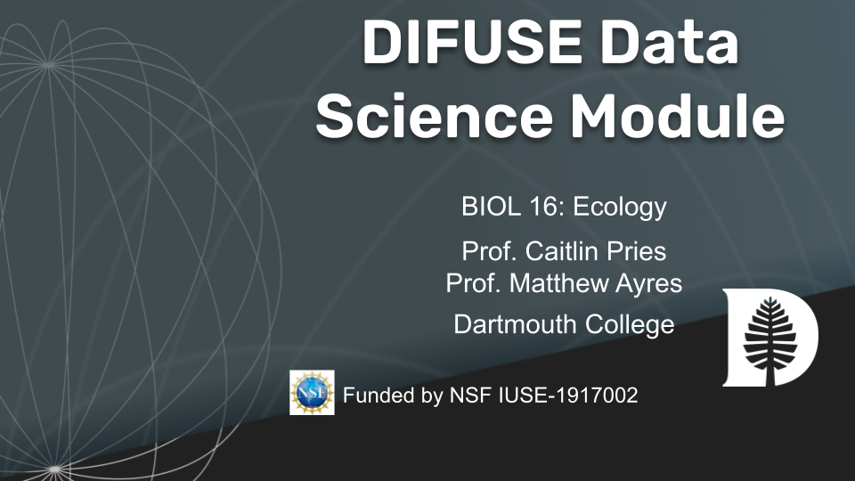

# Ecology: Eddy Covariance DIFUSE Data Science Module 

## Contributors: Quang Nguyen ('GR), Pierre Desvallons ('21), Professor Caitlin E. Hicks Pries (Professor of Biological Sciences), Professor Matthew P. Ayres (Professor of Biological Sciences), Professor Scott Pauls (PI), Professor Laura Ray (PI), Professor Petra Bonfert-Taylor (PI), Professor Lorie Loeb (PI).

This module was developed through the DIFUSE project at Dartmouth College and funded by the National Science Foundation award IUSE-1917002.

|| <a rel="license" href="http://creativecommons.org/licenses/by-sa/4.0/"> </a>This work is licensed under a <a rel="license" href="http://creativecommons.org/licenses/by-sa/4.0/">Creative Commons Attribution-ShareAlike 4.0 International License</a>. |
|---------|----------|

## Module Objective

The primary objective for this module is to bridge the gap for students between raw data and insights that can be achieved from eddy covariance data 

## Learning Objectives

1.	Explore and observe patterns from raw eddy covariance data and implications towards net ecosystem exchange (NEE)
2.	Visualize and understand differences between seasons (summer vs winter) and time of day (night vs day)
3.	Discover important meteorological and phenological properties that contribute towards overall ecosystem NEE
4.	Use eddy covariance data to estimate an annual carbon budget

## Module Description
Students complete use a web interface to explore eddy covariance data through visualization and modeling.  The goal is for students to gain insight into how CO2, wter, heat, and methane exchange depends on various environmental factors - wind speed and direction, temparture, moisture, etc.  Students first examine the raw data to build intuition and make conjectures and then turn to exploring processed data.  The app allows students to build their own regression models for exploratory data analysis as well as hypothesis testing.

### Data
The module uses raw eddy covariance data from a flux tower at the Silas Little Experimental Forest.Data sets include periods from both summer and winter, with 10Hz measurements of air temperature, CO2, water vapor and 3D-wind speed. 

### Platform
This module uses an RShiny webapp.

## Schedule and Links

Use this table to get an idea of the timeline of the module, what components are involved, and what documents are related to each component. This is the schedule intended for module deployment by the DIFUSE team, though instructors are welcome to modify the timeline to fit their course environment.

### This Module uses an [RShiny web app for data visualization](https://difuse-dartmouth.shinyapps.io/DIFUSEEddyCovariance/)
The website application is also linked in the Lab Handout (see below)

| Material |  Description | Linked course content | Files (Linked to Repository Contents) |
|------------------|-----------------|----------------------------------------|--------------------------------------------------|
| Lab Introduction | Introductory Slideshow for Lab Instructor; describes concepts covered in lab and what the module will cover.| Lab Presentation |[Eddy Covariance Lab Presentation](completed_module/logistics/Eddy Covariance Lab Presentation.pptx) |
| Lab | The purpose of this lab therefore is to introduce you to the basics of EC, to explore raw measurement data to observe patterns of eddies across seasons and time of day, and to use relationships between ecosystem carbon fluxes and meteorological variables to estimate the annual carbon balance of an ecosystem.  | Lab Handout |[Eddy Covariance Lab Handout](completed_module/components/Eddy Covariance Lab Handout.docx) |

## Course information
This course was developed for a biology course, [Ecology](http://dartmouth.smartcatalogiq.com/current/orc/Departments-Programs-Undergraduate/Biological-Sciences/BIOL-Biological-Sciences-Undergraduate/BIOL-16), at Dartmouth College which serves as an introduction to ecology.  This course has no prerequisites. Students are not expected to have any background in coding.

|| <a rel="license" href="http://creativecommons.org/licenses/by-sa/4.0/"> </a>This work is licensed under a <a rel="license" href="http://creativecommons.org/licenses/by-sa/4.0/">Creative Commons Attribution-ShareAlike 4.0 International License</a>. |
|---------|----------|
